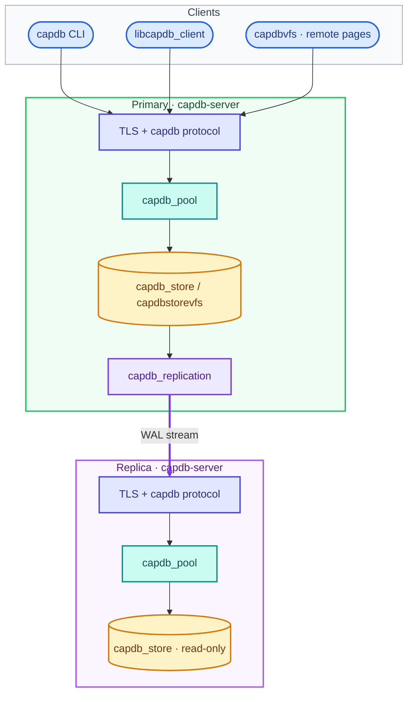

<p align="center">
  
</p>

<p align="center">
  <strong>Networked SQL — pooled, secured, and replication-ready</strong>
</p>

<p align="center">
  <a href="https://github.com/rickcollette/CapDB/actions/workflows/ci.yml"></a>
  <a href="LICENSE"></a>
  <a href="capdb/README.md"></a>
  <a href="docs/BUILD.md"></a>
  <a href="SECURITY.md"></a>
</p>

---

**CapDB** is a standalone SQL database engine for embedded apps and server deployments. Use it locally with the `capdb` shell, embed the `libcapdb` library, or connect over **`capdb://`** to a TLS-backed SQL server with pooling, path jails, and optional **primary/replica HA**.

Standard SQL, portable database files, and a production-focused stack: **connection pool**, **network server**, **volume store**, and **WAL replication**.

Build with **CMake** — no Tcl required. Tests run via `ctest`, `capsuite`, and native C binaries.

## Highlights

| | |
|---|---|
| **Engine** | Full SQL database with `capdb` / `libcapdb` — local files or remote access |
| **Pool** | `capdb_pool_*` checkout/checkin with WAL defaults and busy-timeout handling |
| **Network** | `capdb://` remote SQL over TLS; `capdb-server` executes on server-side files |
| **HA volumes** | `capdbstorevfs` volume layout, WAL segments, LSN tracking, sync replication |
| **Replication** | Primary streams WAL to replicas; generation fencing and path jails |
| **CLI** | Interactive `capdb` shell with dot-commands and batch mode |

## Quick start

```bash
git clone https://github.com/rickcollette/CapDB.git
cd CapDB

cmake -B build \
  -DCAPDB_ENABLE_POOL=ON \
  -DCAPDB_ENABLE_NETWORK=ON \
  -DCAPDB_ENABLE_STORE=ON \
  -DCAPDB_ENABLE_REPLICATION=ON \
  -DCAPDB_BUILD_TESTS=ON

cmake --build build -j$(nproc)
cd build && ctest --output-on-failure
```

**Local shell**

```bash
./build/capdb my.db
./build/capdb -batch my.db 'SELECT 1;'
```

**Remote (dev — no TLS)**

```bash
./build/capdb-server --listen 127.0.0.1:5432 \
  --auth-file ./tokens.txt --db-root ./data --insecure

./build/capdb 'capdb://127.0.0.1:5432/app.db?token=SECRET&insecure=1'
```

Generated sources (`capdb.c`, `capdb.h`, `shell.c`) are produced at build time under `build/generated/`. See [docs/LAYOUT.md](docs/LAYOUT.md).

## Architecture



| Mode | Storage flag | Use case |
|------|----------------|----------|
| Legacy | `--db-root` | Single-node SQL server over POSIX files |
| Volume / HA | `--storage volume --volume-root` | Replication, failover, LSN-backed WAL |
| Remote VFS | `capdbvfs` on client | Embedded engine; server does page I/O (non-HA) |

## Documentation

| Topic | Document |
|-------|----------|
| User guide | [docs/CAPDB.md](docs/CAPDB.md) |
| Build & install | [docs/BUILD.md](docs/BUILD.md) |
| Repository layout | [docs/LAYOUT.md](docs/LAYOUT.md) |
| HA storage ADR | [docs/adr/001-storage-engine.md](docs/adr/001-storage-engine.md) |
| Changelog | [CHANGELOG.md](CHANGELOG.md) |
| CLI man page | [man/capdb.1](man/capdb.1) |
| Server man page | [man/capdb-server.1](man/capdb-server.1) |
| Network layer | [capdb/README.md](capdb/README.md) |
| Connection pool | [capdb/pool/README.md](capdb/pool/README.md) |
| Volume store | [capdb/store/README.md](capdb/store/README.md) |
| Replication | [capdb/replication/README.md](capdb/replication/README.md) |

## HA example (primary + replica)

```bash
# Primary
capdb-server --storage volume --volume-root /var/lib/capdb/volumes \
  --listen 0.0.0.0:5432 --auth-file /etc/capdb/tokens \
  --rep-listen 0.0.0.0:5433 --rep-token SECRET --cert srv.pem --key srv.key

# Replica (read-only SQL; catches up via replication)
capdb-server --storage volume --volume-root /var/lib/capdb/volumes \
  --role replica --rep-primary primary.host:5433 --rep-token SECRET \
  --listen 0.0.0.0:5432 --auth-file /etc/capdb/tokens \
  --cert srv.pem --key srv.key
```

Client read fan-out: `read_preference=replica` and `replicas=` on the `capdb://` URI. See [capdb/README.md](capdb/README.md).

## Security

> [!CAUTION]
> **`--insecure` disables TLS.** Use it only on loopback or isolated lab networks. Credentials and SQL are visible on the wire.

> [!IMPORTANT]
> Report vulnerabilities through [GitHub private security advisories](https://github.com/rickcollette/CapDB/security/advisories/new) — not public issues. See [SECURITY.md](SECURITY.md) for the full policy.

Built-in hardening includes path jails (`realpath` + prefix checks), replica read-only gates on `EXEC`/`PREPARE`/`STEP`, required replication tokens, `ATTACH` denial in volume mode, and generation fencing on replicated WAL.

## Licensing

CapDB server, pool, store, replication, networking, and client code is **[MIT licensed](LICENSE)** (© 2026 Rick Collette). See [LICENSE.md](LICENSE.md) for per-path scope.

The core SQL engine retains its public-domain heritage from upstream sources; CapDB is a distinct product with its own APIs (`capdb_*`, `CAPDB_*`), wire protocol (`capdb://`), and operational tooling. Background: [docs/upstream/README-LEGACY.md](docs/upstream/README-LEGACY.md).
